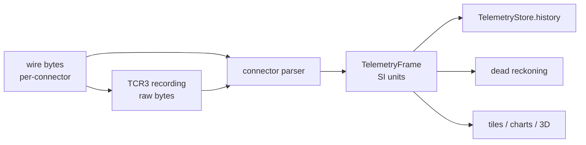

# Internal Representation

One struct flows through the app: `TelemetryFrame`
([telemetry_frame.dart](../packages/serial/lib/telemetry/telemetry_frame.dart)).
Every connector decodes its own wire format into it; raw bytes never leave
`packages/serial`. All fields are SI units (metres, m/s, m/s², deg, V).



## Position: lat, lon, relative altitude

```text
        MSL datum (sea level, 0 m)
          │
          │  site.altitudeMsl  (e.g. 403 m — metadata, not telemetry)
          ▼
   ─ ─ ─ PAD ─ ─ ─ ─ ─ ─   relative 0 m  ← frame.baroAltitude == 0
          │  ▲
          │  │  baroAltitude (m, pad-relative, signed)
          ▼  │
        ROCKET               frame.altitudeMsl(groundMsl) = groundMsl + baroAltitude
```

- `latitude` / `longitude`: WGS84 degrees, positive North / East.
- `baroAltitude`: metres **above the launch site**. Zero is the pad.
  The connector picks the source sensor (baro / Kalman); there is no
  separate GPS altitude. GPS never feeds altitude.
- `altitudeMsl(groundMsl)`: converts to MSL at the call site. `groundMsl`
  comes from the effective launch site (live selection, recording header
  on replay) or the DEM datum under the pad. The frame itself stores no MSL.
- Baro drift on the pad renders as-is. There is no grounded-state
  snapping: fix a wrong site MSL instead of hiding it.

## Velocity: North / East / Up, Up positive

```text
              N (+velocityNorth)
              ▲
              │
              │     U (+velocityUp, away from ground)
              │    ╱
              │   ╱
              │  ╱
              │ ╱
              │╱─────────▶ E (+velocityEast)
           ROCKET
```

- NEU frame in m/s. Up is **positive** (climbing reads `+`, falling reads `-`).
- Derived: `speedHorizontal = √(N²+E²)`, `speedVertical = velocityUp`
  (signed), `speedTotal = √(N²+E²+U²)`.
- Feeds are partial: SegFault sends **vertical only** (N/E decode as 0).
  Capabilities split accordingly (`velocityHorizontal`,
  `velocityVertical` in
  [connector.dart](../packages/serial/lib/connectors/connector.dart)).

### Totals rule

A total is shown only when **every** component is populated.
`FieldCapabilities.hasFullVelocity` (and `hasFullAcceleration`) is the
single check; the velocity chart uses it. With a vertical-only feed,
`speedTotal` would equal `|vertical|` and understate — so the Total
series is omitted instead of showing a wrong number. The highlights
Top-speed cell instead always shows when any velocity component exists
(on a partial feed it is the available component's peak).

## Acceleration: body frame, specific force

```text
   nose (+Z, longitudinal)          pad sit:  ax≈0, ay≈0, az≈+9.81
      ▲                             boost:    az ≈ thrust + 9.81
      │                             coast:    az ≈ −drag (small, negative)
      │                             canopy:   az ≈ drag + 9.81 (clamped)
      │
   ───┼───▶ +X
      │
      ▼ +Y (out of page toward viewer in docs convention)
   ROCKET (sitting nose-up)
```

- `accelX` / `accelY` / `accelZ` in m/s², **specific force**: the sensor
  reads `+9.81` on Z sitting nose-up on the pad, not 0.
- The frame rotates with the airframe. `accelZ` is the longitudinal
  (thrust/drag) channel; world conversion happens only in dead reckoning,
  never in the connector. v1 attitude stays usable because nothing
  consumes its accel as world-frame.
- Derived: `accelHorizontal = √(X²+Y²)`, `accelVertical = accelZ`,
  `accelTotal = √(X²+Y²+Z²)`. Same totals rule: Total renders only under
  `hasFullAcceleration` (true on all current connectors — the gate is
  future-proofing).

## Gyro: body frame, deg/s

`gyroX` / `gyroY` / `gyroZ` in deg/s, same body axes as acceleration.
`gyroZ` is the longitudinal spin rate. Currently carried for attitude
propagation and recording completeness; no tile charts it.

## Attitude: Euler, rocket-oriented

Not aircraft-oriented. Three scalars, degrees:

```text
  pitch: tilt away from vertical        yaw: nose compass heading        roll: spin about nose
   0° = nose straight up                 0° = North, 90° = East            unbounded, deg
   90° = horizontal                      (merges heading when             (wraps freely)
                                         the 3D compass lands)

        │ N                               ▲                                ╭───╮
        │  ╲                              │                                 │   │ roll
        │   ╲ nose                        │ nose                            ╰───╯
        │    ╲                            │
        │ pitch                          rocket viewed from above,
        │     ╲                          yaw rotates the nose
        └──────╲───                     around the vertical
```

- `pitch` 0 = up, `roll` unbounded spin, `yaw` nose heading in `[0, 360)`.
- v1 has no compass: `roll`/`pitch` derive from the accel vector (gravity
  projection, same as the legacy web client), `yaw`/`heading` stay 0.
  Mock and the new compass firmware report all three.
- Replay smoothing averages the specific-force *vector* before `atan2`
  (`smoothedAttitude` in
  [flight_scene_builder.dart](../lib/ui/tiles/shared/flight_scene_builder.dart)),
  never the angles — stable through apogee free-fall and chute swing.

## GPS fix: one flag

`gpsHasFix` reads `FrameFlags.gpsFix` alone. The old 3D-fix wire bit
(`gpsFix3d`) still decodes to preserve the flags byte but is never set on
encode and never read. OG SegFault frames assume a fix (no fix bits on
that wire); demo firmware reports no fix with identical bytes.

## Time and sequence

- `receivedAtMs`: wall-clock parse time (Unix epoch, ms). Orders frames,
  drives replay clocks and link-staleness checks.
- `sequence`: rolling rocket counter for drop detection. SegFault's 8-bit
  `packetId` wraps; mock uses 16-bit.

## FSM: id on the frame, meaning on the connector

The frame carries only `fsmStateId` (raw byte, `fsmState` decodes the
mock vocabulary). Everything else lives on the connector's
`ConnectorFsmState`
([connector.dart](../packages/serial/lib/connectors/connector.dart)):

| Flag | Meaning | Used by |
|---|---|---|
| `hasNosecone` | cone on | nose-cone tile, 3D airframe |
| `hasParachute` | chute deployed incl. collapsed | nose-cone tile |
| `showsParachute` | open canopy (3D renders it) | 3D views |
| `grounded` | verifiably on pad/ground | events, (no longer scene pinning) |
| `pipeline` | nominal flight vs bench branch | progress bar, pipeline grid |

State ids differ per rocket (mock 0–7, v1 0–4, demo 2×2 matrix);
`stateForId` resolves with an `unknown (255)` fallback. Flight events
(Launch / Apogee / Parachute / Touchdown) derive from each connector's
own transition table, including direct-jump entries for firmware that
skips states.

## Battery and hall

- `batteryVoltage`: pack volts (V).
- `hallRaw`: breakaway-wire ADC count (~2500 intact, ~2950 snapped at
  apogee). Thresholded by consumers, never interpreted in the frame.

## Connector matrix

| Field | mock | segfault (v1) | segfault_demo |
|---|---|---|---|
| `gpsPosition` | ✓ | ✓ (base + offset) | — |
| `baroAltitude` | ✓ | ✓ (Kalman AGL) | ✓ |
| `velocityHorizontal` | ✓ | — | — |
| `velocityVertical` | ✓ | ✓ | ✓ |
| `acceleration` (full triple) | ✓ | ✓ (body) | ✓ (body) |
| `gyro` | ✓ | ✓ | ✓ |
| `attitude` | ✓ | partial (yaw 0) | partial (yaw 0) |
| `battery` / `hall` / `fsm` | ✓ | ✓ | ✓ |

Tiles gate on these via `unsupportedPlaceholder` / `hasFullVelocity` —
"not provided by this connector" instead of eternal "waiting for data".

## Dead reckoning: NEU projection onto pad-relative ground

Inputs map 1:1 from the frame
([dead_reckoning_adapter.dart](../lib/core/dead_reckoning_adapter.dart)):
relative altitude, NEU velocity, longitudinal accel, yaw/pitch.

```text
  last fix ──► pos + v·dt + ½·a·dt² ──► estimate
                  │                    │
  nose dir        │  a = nose·accelZ   │  ground plane
  from yaw/pitch  │  − gravity (up+)   │  at relative 0:
                  ▼                    ▼  freeze at touchdown,
              world (up+)            never sink through
```

Ground is the flat plane at relative 0 and DR altitude is pad-relative,
so the 3D view renders it directly with no MSL subtraction. Live-only
gap filler (never in replays); v1 never feeds it (body accel stays
unrotated there by design).

## Launch site: anchor and stamp, never telemetry

`LaunchSite` (name + lat + lon + `altitudeMsl`) does not alter incoming
frames. It:

1. Anchors the 3D world origin and map flag (`flightAnchor`).
2. Supplies `groundMsl` for `altitudeMsl()` and terrain relief.
3. Is stamped into the TCR3 header on record
   ([recording_provider.dart](../lib/state/recording_provider.dart))
   and overrides the live selection during replay
   (`effectiveLaunchSiteProvider` in
   [replay_controller.dart](../lib/state/replay_controller.dart)).
4. Measures drift (haversine, site → fix/estimate).

Mock-sim and SegFault-base coordinates are fixed at their own pads;
selecting another site moves the anchor, never the reported track.

## 3D world frame

Right-handed: **X east, Y up (relative altitude, AGL), Z south**
(`worldFromLatLon`,
[flight_scene_builder.dart](../lib/ui/tiles/shared/flight_scene_builder.dart)).
Trail and rocket Y render raw relative altitude; the dead-reckoning
estimate renders as a single point off-trail while GPS is stale.

## Wire compatibility

The wire is untouched — recordings store raw bytes, so old files replay
under the new model:

- Mock 52 B payload: the legacy GPS-altitude slot mirrors baro on
  encode and is ignored on decode; the Down-velocity slot carries
  `-velocityUp` (negated both ways).
- SegFault 33 B payload: unchanged framing, `velocityUp` direct.
- Healed semantics: `speedVertical`/`velocityUp` positive-up everywhere;
  old `velocityDown` sign errors do not survive the migration.

## Recipes

- **Show MSL altitude**: `formatAltitudeM(frame.altitudeMsl(site.altitudeMsl))`
  with the effective site; fall back to the DEM datum when siteless.
- **Show drift**: `haversineDistanceM(site.lat, site.lon, fix.lat, fix.lon)`.
- **Gate a total**: `connector.capabilities.hasFullVelocity` /
  `.hasFullAcceleration` before reading `speedTotal` / `accelTotal`.
- **Gate one component**: `supports(TelemetryField.velocityVertical)` etc.
- **Add a field**: extend `TelemetryFrame`, map it in each connector's
  codec, add a `TelemetryField` + capabilities entry, gate the tile.
